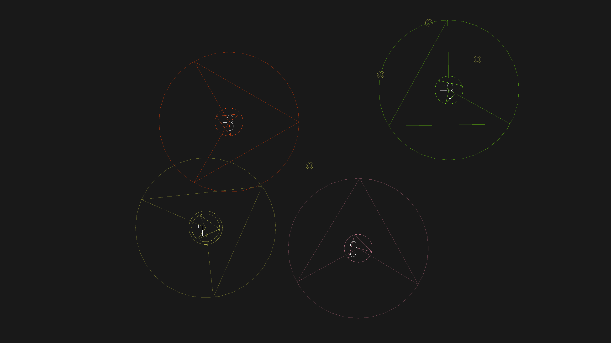

# Gravity Combat

Author: Matei Budiu

Design: Gravity Combat is a multiplayer shooter game where players control not only their position, but also a gravity field which they
can use to their advantage in blocking and accelerating bullets.

Networking: Everything is handled by the server, which receives input from the players. Servers transmit a message every frame to players 
describing the positions, velocities, and colors of players and bullets, and the orientations and scores of players. Sending/receiving
the state is done in Game::send/recv_state_message.

Screen Shot:

How To Play:

Your player marker is marked with two circles. Use WASD to move around, which will change your orientation to your direction of motion.
Press space to fire a bullet, or hold to continuously fire. Bullets bounce off walls once and you can have at most 5 on the screen at a time.
If bullets collide with other bullets, they will cancel out, and if they collide with a player, the player firing the bullet will
gain a point, and the hit player will lose a point. Score is drawn on each player. You can also use Q and E to rotate your gravity
field, which will affect the velocities of any bullets within the larger circle around your player.

Aim your gravity field in such a way to boost the speed of your bullets, and to block incoming bullets. Your own bullets will be less
affected by your gravity field than bullets fired by a different player. If firing directly at a player isn't working, try hitting them at an angle.
You can't hide in the corners because the play area for bullets is slightly larger (the red box) than that for players (the magenta box).

Sources: Besides the base code, no external sources were used. However, the bullet mechanics were inspired by [another game of mine.](https://github.com/aehmttw/tanks)

This game was built with [NEST](NEST.md).

